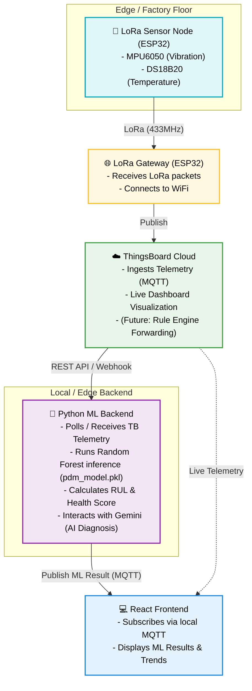

# IoT Predictive Maintenance (PDM) Project Overview

## Project Architecture

The system is designed to perform Predictive Maintenance on industrial machinery using a combination of edge sensors, long-range communication (LoRa), a central cloud platform (ThingsBoard), and a local Python-based Machine Learning (ML) backend.

The architecture flows from the physical sensors all the way to the user dashboard:

## How It Works

### 1. Sensor Node (Transmitter)
An ESP32 sits on the machinery and reads:
- **Temperature** from the DS18B20 sensor.
- **Vibration/Acceleration** from the MPU6050 sensor.
These values are bundled into a packet and sent via LoRa (433MHz) to maximize range and battery efficiency in noisy industrial environments.

### 2. Receiver Gateway
A second ESP32 acts as the LoRa receiver and internet gateway. It:
- Listens for LoRa packets from the sensor nodes.
- Extracts the temperature and vibration strings.
- Connects to a local WiFi network.
- Formats the data into a JSON payload.
- Publishes the payload directly to **ThingsBoard Cloud** using ThingsBoard's built-in MQTT broker.

### 3. ThingsBoard Cloud
ThingsBoard acts as the central data ingestion point. It receives the live streaming telemetry from the Gateway. This allows for immediate, out-of-the-box dashboards on ThingsBoard without routing through intermediate local servers.

### 4. Machine Learning Backend (Python)
The backend (`server.py`) is responsible for AI analysis and predictive maintenance. Since the live data now goes directly to ThingsBoard, the Python backend interfaces with ThingsBoard to retrieve the latest telemetry.
- It applies a highly trained scikit-learn model (`pdm_model.pkl`) to classify the machinery as `Healthy` or `Faulty`.
- It calculates advanced metrics like **Health Score**, **Remaining Useful Life (RUL)**, and **Statistical Trends**.
- It provides root cause analysis using Google's Gemini LLM.

### 5. Frontend Dashboard
A React dashboard connects to a local/public HiveMQ MQTT broker to receive the processed analytical results (AI classification, health score) from the backend, providing a comprehensive operational view.
